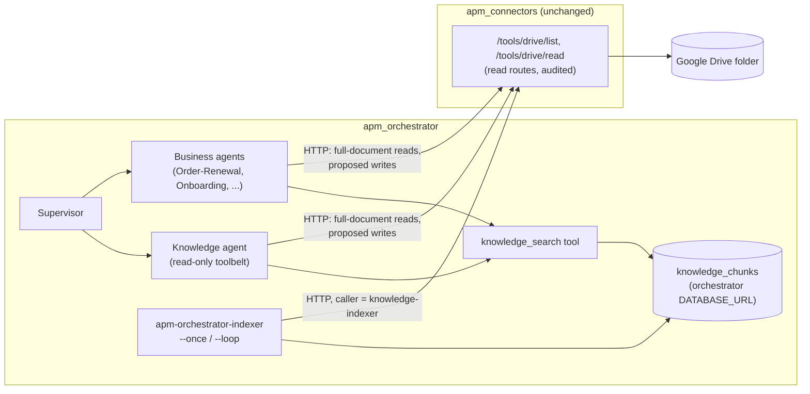

# Knowledge Agent and Retrieval Index — Where They Live

A placement decision, made before any code, from re-reading both repos
(`apm_orchestrator` at `8da9628`, `apm_connectors` at `fad7472`). Same
pre-implementation-contract style as `CUSTOMER_ONBOARDING_CONTRACT.md`:
this document decides the boundaries; the implementation lands against
it afterward.

## Decision

| Piece | Lives in | Package / entry point |
|---|---|---|
| Retrieval index (chunk store + search) | **`apm_orchestrator`** | `src/apm_orchestrator/knowledge/` — tables in this repo's own `DATABASE_URL` |
| Index sync job (ingest/reconcile) | **`apm_orchestrator`** | `apm-orchestrator-indexer --once \| --loop`, same shape as `poller.py` |
| `knowledge_search` tool | **`apm_orchestrator`** | an in-process `@tool` next to `tools.py`'s connector tools, handed to toolbelts via `allowed_tools` |
| Knowledge agent (Q&A over the index) | **`apm_orchestrator`** | `agents/knowledge/` + `delegate_to_knowledge` in `supervisor.py` — *second*, after the index proves itself |
| Reading source documents | **`apm_connectors`, unchanged** | existing `POST /tools/drive/list` + `/tools/drive/read` read routes — no new route, no contract change |

Nothing about retrieval goes into `apm_connectors`. It stays the only
way a document is *read* from an external system; it never holds a
copy of one.

## Why not `apm_connectors`

Tempting because the connectors repo already holds the Drive
credentials. Three things in its own docs rule it out:

1. **It forbids persisting content.** `docs/security-guardrails.md`
   §3: "No email/calendar/spreadsheet content is persisted beyond what's
   needed to show the current process status." A retrieval index exists
   specifically to persist document text. Putting it there would mean
   rewriting a security baseline, not just adding a connector.
2. **It has no model calls, and says so.** `docs/architecture.md`: "no
   LLM call anywhere in this process." `pyproject.toml`: "no
   Anthropic/Claude dependency anywhere in this package." Embeddings
   are a model call. Choosing chunk sizes and ranking results are
   relevance judgments. Both are reasoning, which its `CLAUDE.md` says
   belongs "in a separate reasoning/orchestration layer calling this
   API."
3. **It is a pass-through, not a derived copy.** Every connector reads
   straight from the system of record at call time. An index is a
   second copy that can go stale. `docs/roadmap.md` already warns
   about "two systems both claiming to hold the live record" (Excel
   vs. Salesforce). The index is only safe as a clearly derived cache,
   owned by the layer that decides how to use it.

What the index gets from staying on the orchestrator side: every
document it ingests is read through connectors' existing read routes,
so every ingestion shows up in connectors' audit trail. Give the
indexer its own `APM_API_KEYS` entry (`knowledge-indexer:<key>`) and
its reads carry a caller distinct from the agents' reads, with no
connectors change.

## Why not a third repo

`apm_connectors`' `docs/roadmap.md`: "Don't pre-split before that need
shows up." Only one consumer exists (this repo's agents), the index
lives in a Postgres database this repo already runs, and the sync job
fits the pattern `poller.py` already set. Split it out when one of
these becomes true, not before:

- a second consumer outside this repo (e.g. the Phase 2 avatar service
  querying the index directly rather than through an agent), or
- ingestion or query load that needs to scale separately from agent
  compute.

## The knowledge agent: a Supervisor delegate, not a service other agents call

A "knowledge agent" is the closest thing in this design to the
per-connector agent `docs/roadmap.md` warns against, so it is scoped
tightly:

- **Business agents never delegate to it.** No agent-to-agent hop.
  Order-Renewal, Onboarding and later agents get `knowledge_search`
  directly in their own toolbelt. Case graphs call the index module
  directly, as one fixed node, with no LLM in the loop. The roadmap
  calls for tools used "from inside that one agent's own run, not
  fanned out across … separate agent hops."
- **It exists only for the case where a human's request *is* a
  question** ("what's Acme's termination-notice period?"): answering
  it is the whole business process. The Supervisor routes those
  questions to it.
- **Its toolbelt is read-only, permanently:** `knowledge_search`,
  `drive_read_file`, `salesforce_query_records`/`get_record`,
  `jira_search_issues`/`get_issue`. It never gets a write tool. If a
  question turns into "…so go update the renewal," that's a new request
  for a business agent. The knowledge agent never proposes the write
  itself.
- **One deliberate exception to "each agent = `policy.yaml` +
  `case_graph.py`":** it gets a `policy.yaml` (which collections it may
  search, citation required on every answer) but no `case_graph.py`. A
  case graph exists to durably wait on human approvals, and a read-only
  agent has none to wait on.
- **Its delegate follows the existing routing rules.**
  `delegate_to_knowledge` requires `confidence` + `rationale` like every
  other delegate. The routing rule in `SYSTEM_PROMPT` becomes: *any
  request asking for an action goes to a business agent, even if it
  also asks a question; only a pure question goes to knowledge.*
  "Acme wants to renew — what does their contract say about price
  caps?" is Order-Renewal.
- **Adding it resets calibration.** The 26-row verdict in
  `FAILURES_AND_LESSONS_LEARNED.md` §11 was measured with two
  delegates. A third delegate adds new boundaries (renewal vs.
  question, onboarding vs. question). So this needs new
  `evals/routing_cases.py` cases (including ambiguous
  question-plus-action ones) and a fresh calibration run. Don't pool
  new rows into the old two-delegate verdict.

## Index design constraints (the non-obvious ones)

**First consumer: fix the Drive lookups that exist today.**
`order_renewal/case_graph.py`'s `pull_contract_node` searches with
`drive_list_files(name_contains=state["account_name"])` and takes
`files[0]`. That is both failure patterns this repo's `CLAUDE.md`
already bans for Salesforce: an exact-string match (an account named
"Acme Corp." doesn't match a file named "Acme Corp - MSA.pdf") and an
arbitrary first pick (a UK subsidiary's contract can come back first).
`customer_onboarding`'s `pull_kickoff_packet_node` has the same
`files[0]` shape. Replacing these with a filtered `knowledge_search`
call gives the index a concrete, testable first job, before any Q&A
agent exists.

**Scoping has to be rebuilt, because the index removes it.**
`drive_tool.py` guarantees in code that nothing outside
`APM_DRIVE_FOLDER_ID` is reachable. An index merges everything it
ingested into one searchable table, so any agent holding
`knowledge_search` could reach any document in it. The fix:

- tag every chunk with a `collection` at ingest (derived from the
  source, e.g. `contracts`, `onboarding_templates`);
- list the collections each agent may search in its own `policy.yaml`
  (`knowledge_collections: [...]`), per "policy is data, not code";
- apply that filter in the SQL `WHERE` clause, never by asking the
  model to ignore results.

**Stay in sync with the source, including deletions.** Store `file_id`,
`modified_time`, `web_view_link` and a content hash per source file.
On each sync run:

- re-index a file whose `modified_time` or hash changed;
- delete the chunks of any file no longer returned by
  `/tools/drive/list`.

A file removed from the scoped folder must disappear from search.
Otherwise the index quietly outlives the folder scoping it was built
from.

**Every hit carries provenance.** Search results return `file_id` +
`web_view_link` + `modified_time` alongside the text. The knowledge
agent must cite them. A business agent that proposes a write based on a
retrieved clause puts the citation in the proposal summary, so the
human approver can see *why* it was proposed, not just *what*. Human
approval is "necessary but not sufficient"
(`security-guardrails.md` §5) when the approver can't see the evidence.

**Treat retrieved text as untrusted input.** Document text can contain
prompt injection (Phase 4 of `docs/roadmap.md`). The damage it can do is
limited in two ways: the knowledge agent has no write tools, and every
business-agent write still stops at connectors' human approval gate.
Keep both limits in place. Don't hand the knowledge agent a write tool
"just for convenience."

**Storing document text is a new kind of data here, so say so.**
`run_supervisor` truncates what it logs to `SupervisorRoutingLog` to
500 chars, because that log is "not a place to store full PII." The index *is* a place that stores
full document text. It gets:

- its own tables (`knowledge_sources`, `knowledge_chunks`), separate
  from `CaseRegistry`/`SupervisorRoutingLog` for the same "different
  concerns, different lifetimes" reason `db.py`'s docstring gives;
- a documented retention rule (chunks live only as long as their source
  file is in the folder, enforced by the sync reconciliation above);
- **Drive only for v1.** No Gmail bodies until a PII/consent decision
  exists (Phase 4).

## Sequencing

1. **Index v1 on Postgres full-text search** (`tsvector` + GIN index)
   in the orchestrator's existing `DATABASE_URL`. No embeddings
   provider, no new secret, no new infra. Covers the indexer,
   collection scoping, sync reconciliation, provenance, and the
   `knowledge_search` tool.
   *Done when* `pull_contract_node`/`pull_kickoff_packet_node` use it
   and have unit tests for the trailing-period and subsidiary cases
   above.
2. **A retrieval eval** in `evals/`: a small golden set of
   question → expected `file_id`, scored by recall@k. It's judged by
   pass rate, like the routing eval. It needs no Claude API calls,
   because lexical search is deterministic.
3. **Embeddings only if the eval shows lexical misses.** Add a
   `pgvector` column and hybrid ranking in the same table. Anthropic
   has no embeddings API, so this adds a provider and a secret to
   `.env.example`. Pin the model explicitly for the same reason
   `CLAUDE.md` requires `model` on every `ClaudeAgentOptions`.
4. **Knowledge agent + `delegate_to_knowledge`**, with its new routing
   cases and a fresh calibration run.

## Open questions (for the repo owner)

- **Does a user-facing Q&A agent earn its place at all?** Steps 1–3
  deliver most of the value (correct document lookups inside existing
  business processes) without changing Supervisor routing. Step 4 is
  worth doing only if people actually ask the system pure questions.
- **Which sources beyond Drive, and when?** Jira issue text is low-risk
  and already readable. Salesforce is better queried live than
  indexed, since it's the system of record. Gmail waits on Phase 4's
  PII/consent policy.
